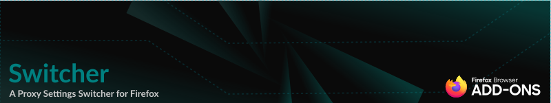
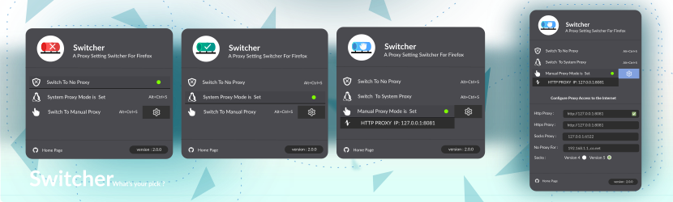

# About Switcher

Switcher is an open-source add-on developed for Mozilla Firefox. This extension allows you to change the proxy settings in your browser with a click.

## What Switcher Brings to Your Browser: 
Here is a simple list of features that `Switcher` will bring to your browser.

- An easy way to switch between proxy modes (`No Proxy`, `System Proxy`, `Manual Proxy`).
- A simple, clean, and beautiful user interface based on `Firefox's` design.
- Displays current proxy settings through an `icon badge` (`N - Red`, `S - Green`, `M - Blue`).
- Navigate through proxy modes using a convenient keyboard shortcut `(Alt + Ctrl + S)`.
- A streamlined manual proxy settings form to effortlessly manage your manual proxy fields.
- Automatically saves proxy settings in your browser, fully synchronized with Firefox proxy settings.
- A `dynamic fields` handler that manages `Copy/Paste` and an `auto-saving mode`, which saves settings when you enter an address or paste it into the fields.
- Switch between proxy modes with a single click on the `proxy buttons`.
- Displays the current `HTTP proxy` that you have set for `manual` use.
- Permanently remembers your `proxy settings` even after closing `Firefox`.

- `Dynamic OS detection` based on your operating system: `Linux`, `OpenBSD`, `FreeBSD`, `macOS`, or `Windows` and update system proxy icon.

## Downloading Switcher
At this moment, Switcher version `2.0.1` is available on `addons.mozilla.org`. To download and use this extension, please follow the link below:

[Switcher](https://addons.mozilla.org/en-US/firefox/addon/switcher_proxy/) `https://addons.mozilla.org/en-US/firefox/addon/switcher_proxy/`

## Debugging and Temporary Installation in Mozilla Firefox
Please follow these two steps:

1. First, download or clone this repository: `git clone https://github.com/vheidari/switcher.git`

2. Second, type `about:debugging#/runtime/this-firefox` in the Firefox address bar, then click on the `Load Temporary Add-on` button and load the `manifest.json` file.

