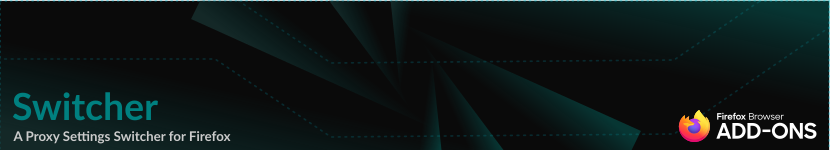

# About Switcher

Switcher is an open-source add-on developed for Mozilla Firefox. This extension allows you to change the proxy settings in your browser with a click.

## Downloading Switcher
At this moment, Switcher version `2.0.0` is available on `addons.mozilla.org`. To download and use this extension, please follow the link below:

[Switcher](https://addons.mozilla.org/en-US/firefox/addon/switcher_proxy/) `https://addons.mozilla.org/en-US/firefox/addon/switcher_proxy/`

## Debugging and Temporary Installation in Mozilla Firefox
Please follow these two steps:

1. First, download or clone this repository: `git clone https://github.com/vheidari/switcher.git`

2. Second, type `about:debugging#/runtime/this-firefox` in the Firefox address bar, then click on the `Load Temporary Add-on` button and load the `manifest.json` file.

